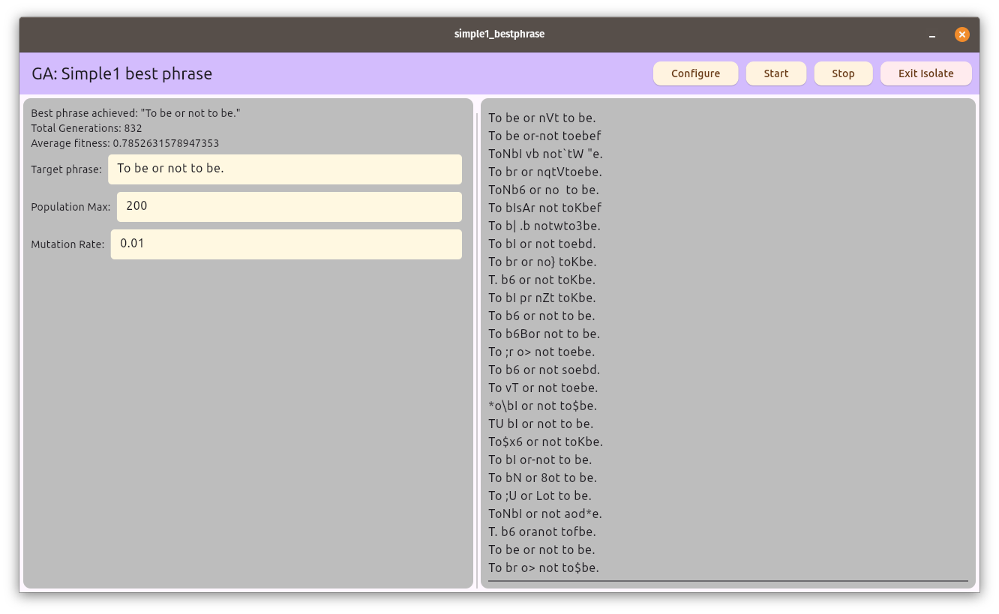

# simple1_bestphrase
The Nature of Code

The Coding Train / Daniel Shiffman

- https://youtu.be/jv3CgDN9sc
- https://thecodingtrain.com/more/achive/nature-of-code/9-genetic-algorithms/9.4-looking-at-code.html

Figures out a phase using GAs.

## Usage
Enter a *target phrase*, *initial population max* and *mutation rate*. Then click **configure** then **Start**. You can **Stop** at any time and then resume using **Start**. **Exit Isolate** simply shutdowns the simulation Isolate, however, you must restart the app to restart the Isolate.

The genetic information (DNA) is a sequence of characters, for example, "Unijorm" has 7 genetic pieces of information.

Regardless of *mutation*, the initial population must contain every gene (aka alphabet chars). The genes are not required to be present in a single *element*. The genes could be dispersed amongst the population. If the population is to small the probability of genes being present decreases to the point that a solution can't be found. If a gene is missing then the algorithm will never converge.

## Steps
- Setup
  - Render
- Selection
- Reproduction
  - Pick parents
  - Crossover
  - Mutation
  - Add new child to a new population
- Replace old population with new population and loop back to Selection

## Algorithm
- Outer loop: **Setup** Create a population of N elements with random genetic material. (Chromosomes). We should have *variation* within the population.
- Inner loop: typically a render function
  - Calculate *fitness* for every member of the population for use during *selection*. The fitness score is typically used as a probability factor.
    - Reproduction/Relection N - loop
      - Pick N parents that will be *mixed*. We use *probability* rather the *best-fit*. This minimizes domination.
      - Make new element from picked parents.
        - Crossover. Pick a crossover position. This position doesn't always need to be constant.
        - Mutation. Mutation *rate* is generally very low, for example, 1%.

The Inner loop's goal is to create a **new** population.

## GUI
Show
- Input the enter phrase (defaults) to "To be or not to be."
- Current element with highest fitness of the population
- Total generations
- Average fitness
- Total population
- Mutation rate
- Scrolling list of generations
